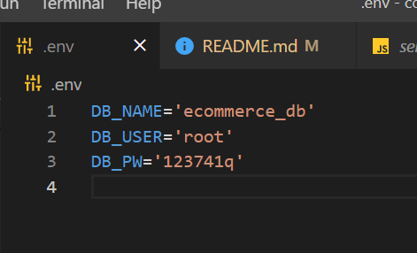
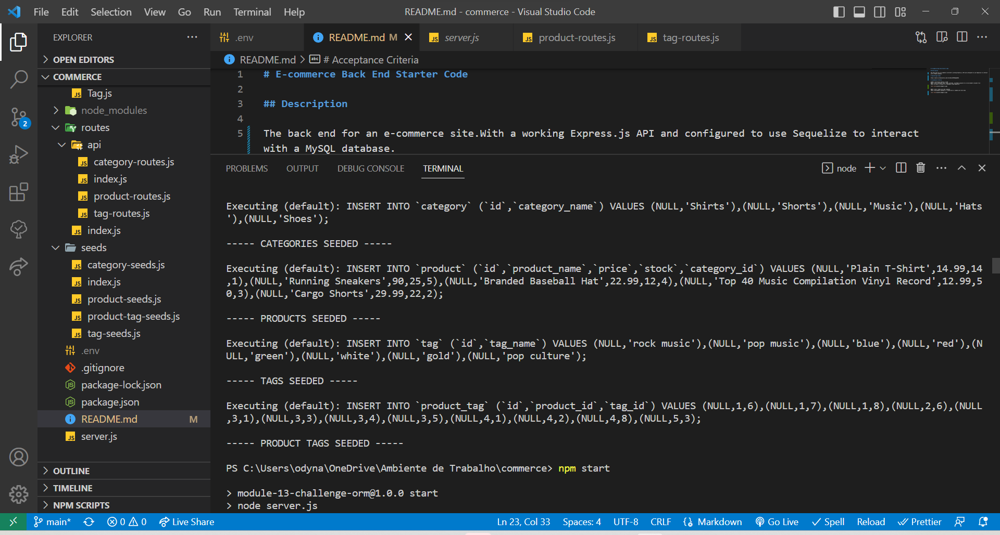
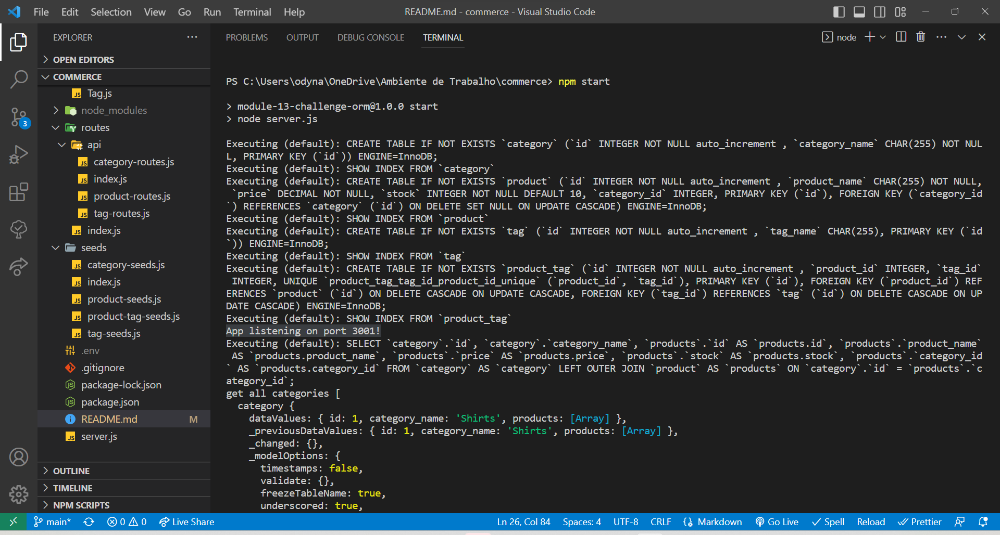

# E-commerce Back End Starter Code

## Description

The back end for an e-commerce site.With a working Express.js API and configured to use Sequelize to interact with a MySQL database.

# Walkthrough Video

https://watch.screencastify.com/v/kvcSZivIV4PbSmpUo9GI

# Acceptance Criteria

WHEN I add my database name, MySQL username, and MySQL password to an environment variable file
THEN I am able to connect to a database using Sequelize

WHEN I enter schema and seed commands
THEN a development database is created and is seeded with test data

WHEN I enter the command to invoke the application
THEN my server is started and the Sequelize models are synced to the MySQL database

WHEN I open API GET routes in Insomnia Core for categories, products, or tags
THEN the data for each of these routes is displayed in a formatted JSON

https://watch.screencastify.com/v/pfAJaWJe4pI2X2ECPrL4

WHEN I test API POST, PUT, and DELETE routes in Insomnia Core
THEN I am able to successfully create, update, and delete data in my database

